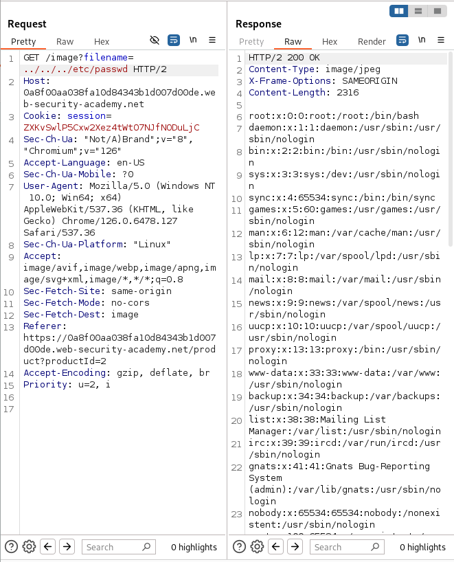

# Lab: File path traversal, simple case

This lab contains a path traversal vulnerability in the display of product images.

To solve the lab, retrieve the contents of the `/etc/passwd` file. 

## Solution
1. Use Burp Suite to intercept and modify a request that fetches a product image
2. Modify the `filename` parameter, send to Repeater and giving it the value:
> `../../../etc/passwd` 
3. Observe that the response contains the contents of the /etc/passwd file.
>  