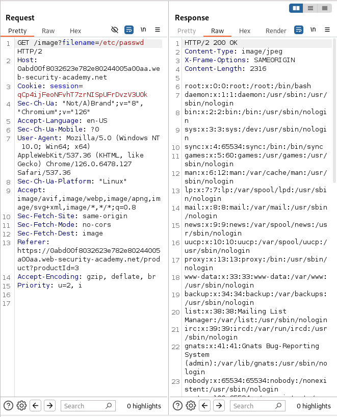

# Lab: File path traversal, traversal sequences blocked with absolute path bypass
This lab contains a path traversal vulnerability in the display of product images.

The application blocks traversal sequences but treats the supplied filename as being relative to a default working directory.

To solve the lab, retrieve the contents of the `/etc/passwd` file. 

## Solution
1. Use Burp Suite to intercept and modify a request that fetches a product image.
   
2. Modift the `filename` parameter, giving it the value `/etc/passwd`.
   
3. Observe that the response contains the contents of the `/etc/passwd file`. 
> 

## Attention!
>/etc/passwd: Always points to the passwd file in the etc directory at the root of the filesystem, no matter where you are in the system.
>
>../../../etc/passwd: Points to the passwd file in the etc folder but based on your current location in the filesystem, needs to move up three directory levels from the current location .

## Conclusion
- The lab "File path traversal, traversal sequences blocked with absolute path bypass" focuses on the path traversal vulnerability, where applications block directory navigation sequences (`../`). However, the application can still be exploited through absolute paths

- Mechanism of action:
  - Blocking: Applications can block the `../` string, but it can still be exploited using absolute paths
  
  - Bypass: An attacker can provide an absolute path like `/etc/passwd` to access a sensitive file