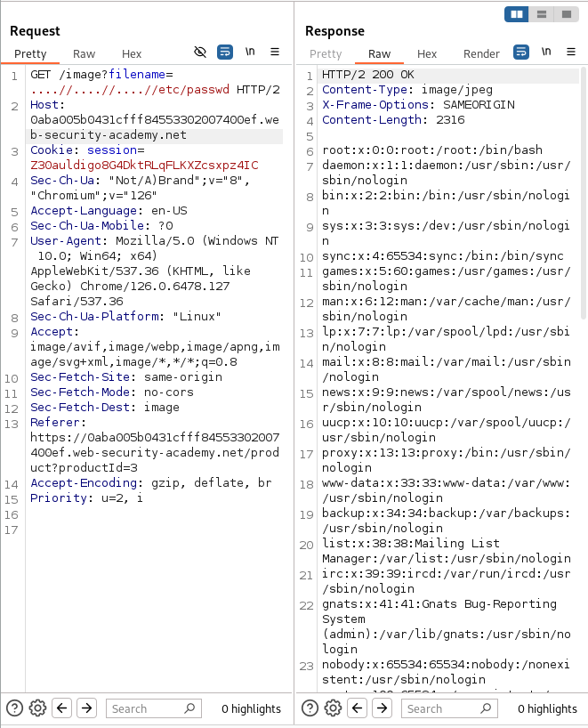

# Lab: File path traversal, traversal sequences stripped non-recursively
This lab contains a path traversal vulnerability in the display of product images.

The application strips path traversal sequences from the user-supplied filename before using it.

To solve the lab, retrieve the contents of the `/etc/passwd` file. 

## Solution
1. Use Burp Suite to intercept and modify a request that fetches a product image.
    
2. Modify the `filename` parameter, giving it the value: 
> `....//....//....//etc/passwd`

3. Observe that the response contains the contents of the `/etc/passwd` file.
>  

## Attention
> `../` is a standard special character for path traversal, often detected and blocked by protection measures.
> 
> `....//` is a variant that may not be properly recognized or blocked in some applications, allowing attackers to exploit path traversal vulnerabilities if protections are not strong enough.

## Conclusion
- The lab "File path traversal, traversal sequences stripped non-recursively" deals with a path traversal vulnerability, where the application only blocks directory navigation sequences (../) at the first level, not recursively. This means the app doesn't fully test navigation levels.

- Mechanism of action:
  - Blocking: The application can only block `../` once, without applying the check to all levels.
  - Bypass: An attacker could exploit the vulnerability by using multiple navigation strings, such as `....//....//....//etc/passwd`, to bypass the blocking mechanism.