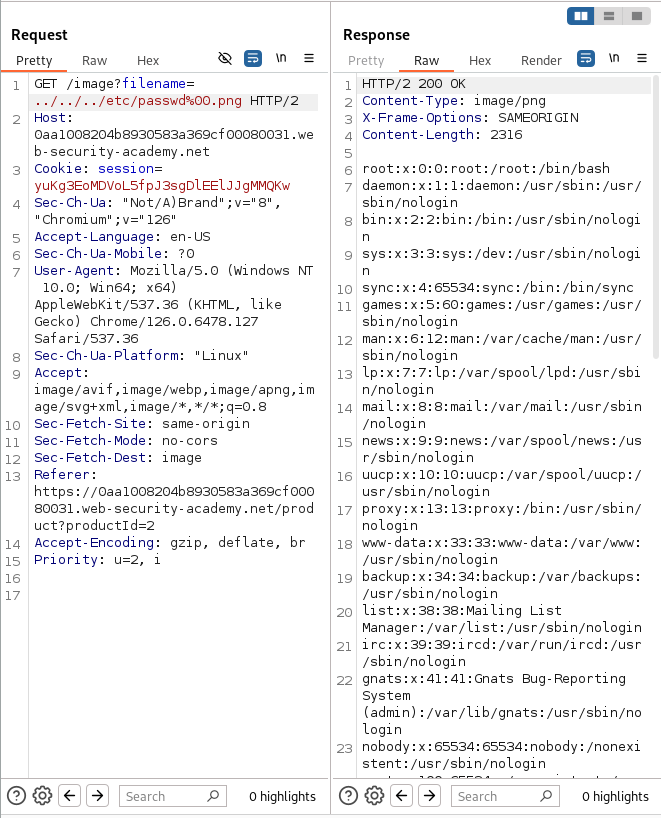

# Lab: File path traversal, validation of file extension with null byte bypass
 This lab contains a path traversal vulnerability in the display of product images.

The application validates that the supplied filename ends with the expected file extension.

To solve the lab, retrieve the contents of the `/etc/passwd` file. 

## Solution
1.  Use Burp Suite to intercept and modify a request that fetches a product image.
2.  Modify the `filename` parameter, giving it the value: 
> `../../../etc/passwd%00.png`
3. Observe that the response contains the contents of the `/etc/passwd` file. 
> 